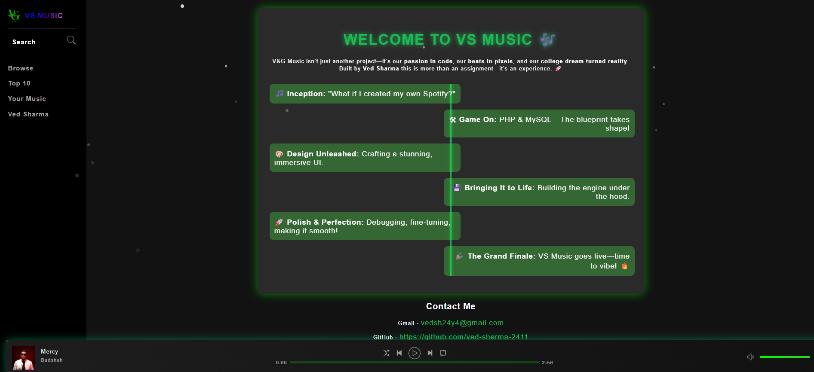
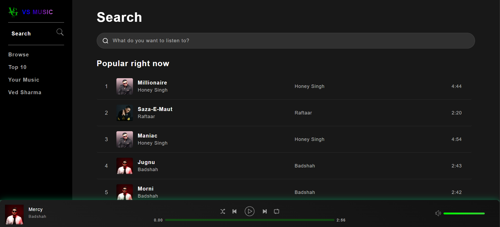
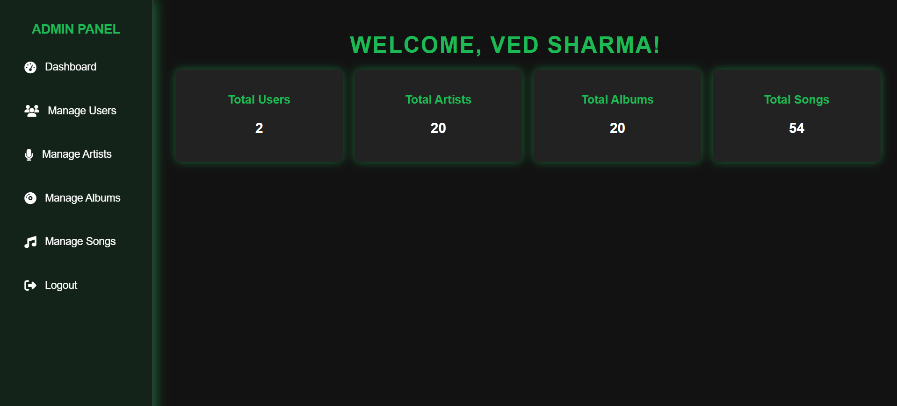

# VS-MUSIC 🎵

VS-MUSIC is a music streaming platform where users can browse, search, and manage music albums, songs, playlists, and artists. It also includes an admin panel for managing users, albums, songs, and artists.

This project, VS MUSIC, was created strictly for academic survival purposes.
In other words: my college asked for a small PHP + MySQL project to award some internal marks, so here it is.

You are free to look, fork, or laugh at the code — but please understand this was never meant to be a production-ready masterpiece.

## Features

### User Features

- Browse and search for music albums, songs, and artists.
- Create and manage playlists.
- View top-rated songs and albums.
- Update user profile details.

### Admin Features

- Manage users, albums, songs, and artists.
- Upload and delete music files.
- Edit album and song details.
- Secure admin login system.

## Admin Login Credentials

- **Username**: `vedadmin`
- **Password**: `vedadmin24y4@`

## Project Structure

```
.htaccess
aboutUs.php
album.php
artist.php
browse.php
index.php
login.php
playlist.php
register.php
search.php
settings.php
topRated.php
updateDetails.php
VS_MUSIC.sql
yourMusic.php
admin/
    admin-login.php
    admin-logout.php
    admin.php
    editAlbum.php
    editArtist.php
    manageAlbums.php
    manageArtists.php
    manageSongs.php
    manageUsers.php
    uploads/
assets/
    css/
    images/
    js/
    music/
Includes/
    config.php
    footer.php
    header.php
    includedFiles.php
    navBarContainer.php
uploads/
```

## Database Structure

The database includes tables for:

- `users`: Stores user information such as username, email, and profile picture.
- `albums`: Stores album details including title, artist, genre, and artwork path.
- `songs`: Stores song details including title, artist, album, genre, duration, and file path.
- `playlists`: Stores playlist details including name, owner, and creation date.
- `playlistssongs`: Maps songs to playlists.
- `genres`: Stores music genres.

## Installation

1. Clone the repository:

   ```bash
   git clone https://github.com/ved-sharma-24y4/VS-MUSIC.git
   ```

2. Import the database:

   - Open `VS_MUSIC.sql` in your database management tool (e.g., phpMyAdmin) and import it.

3. Configure the database connection:

   - Update the database credentials in [`Includes/config.php`](Includes/config.php).

4. Set up the server:

   - Place the project in your server's root directory (e.g., `htdocs` for XAMPP).

5. Access the application:
   - Open your browser and navigate to `http://localhost/VS-MUSIC`.

## Technologies Used

- **Frontend**: HTML, CSS, JavaScript
- **Backend**: PHP
- **Database**: MySQL
- **Server**: Apache (XAMPP)

## Screenshots

### User Interface






### Admin Panel





## License

This project is licensed under the MIT License. See the [LICENSE](LICENSE.txt) file for details.

## Contributing

Contributions are welcome! Please fork the repository and submit a pull request.

## Contact

For any inquiries, please contact:

- **Email**: vedsh24y4@gmail.com
- **GitHub**: [ved-sharma-24y4](https://github.com/ved-sharma-24y4)
- **linkedIn**: [ved-sharma-24y4](www.linkedin.com/in/ved-sharma-24y4)
